# Dev log

## Project Evolution Path

```mermaid
flowchart TD
    classDef milestone fill:#e2e8f0,stroke:#64748b,stroke-width:2px,color:#0f172a,font-weight:bold;
    classDef task fill:#f1f5f9,stroke:#94a3b8,stroke-width:1px,color:#334155;

    Start((Challenge & Requirements)) --> Plan{Day 1: Planning}
    
    Plan --> |Wireframes & Stack Choices| Arch[Architecture & Implementation Plan]:::task
    Arch --> MVP{Day 2: MVP Core}
    
    MVP --> |Supabase & Prisma| DB[Robust Database & Auth Setup]:::task
    DB --> |Gemini SDK & Zod| Extract[Structured Extraction Foundation]:::task
    Extract --> |Metrics & Edits| Review[Case Review UI & Data Binding]:::task
    Review --> Expand{Day 3: Expansion & UX}
    
    Expand --> |TanStack & Responsiveness| Dash[Dashboard Filters & Mobile Polish]:::task
    Dash --> |Metric isolation| Data[Completeness vs Confidence Split]:::task
    Data --> |Zustand| Tour[Guided Interactive Tutorial]:::task
    Tour --> Polish{Day 4: Hardening}

    Polish --> |Dual-fallback| OpenAI[OpenAI Streaming & Live Docs]:::task
    OpenAI --> |Token cost savings| Filter[AI Invalid-Document Rejection]:::task
    Filter --> |Vercel boundaries| UI[4.5MB Payload Caps & Error UX]:::task
    UI --> |Browser Subagent E2E| Prod(((Final Vercel Deployment)))

    class Start,Plan,MVP,Expand,Polish,Prod milestone;
```

---

## Day 1 — April 10, 2026 (Planning & Architecture)

**Time spent:** ~6 hours

### What I did

- Analyzed the challenge requirements, sample documents (8 PDFs), and the service request form structure (Sections A–G)
- Evaluated tech stack options: Next.js (App Router), Supabase (Auth + Postgres + Storage), Prisma ORM, Gemini AI, shadcn/ui
- Researched and pinned latest stable versions of all dependencies (Next.js 16.2.x, Tailwind 4.2.x, Prisma 7.7.x, pdfjs-dist 5.6.x, etc.)
- Designed the extraction pipeline approach: pdfjs text layer extraction → Gemini 3.1 Pro multimodal → structured JSON output with Zod schemas and per-field confidence scoring
- Created wireframes for all 9 screens and the navigation flow (grayscale, focusing on layout and information hierarchy)
- Set up a Trello board with prioritized task columns: ToDo, Doing, Done, Backlog
- Wrote the full implementation plan: architecture diagram, ERD, phased breakdown (Phases 0–5), risk register, model recommendations, and Git strategy
- Prepared the agentic AI development workflow (Cursor rules, phased plan for AI-assisted implementation with human-in-the-loop review)
- Evaluated and deferred non-core features (realtime voice chat, OCR hardening, batch processing, unit/E2E tests) to the backlog — prioritizing AI coding token budget for core features within the challenge timeframe
- Initial commit: planning artifacts, wireframes, sample documents, and assistant avatar asset

### Key decisions

- **Gemini as primary AI provider**: Best multimodal extraction quality for documents, native structured JSON output, single provider simplicity with `@google/genai` SDK
- **shadcn/ui for UI primitives**: Well-documented Radix + CVA pattern, fast to scaffold, consistent design system
- **Prisma ORM for Supabase Postgres**: Type-safe queries, clean schema-as-code, easy migrations
- **Plan-first approach**: Full architecture, wireframes, and phased implementation plan before writing any application code
- **Phased delivery**: Phase 0 (docs) → Phase 1 (scaffold) → Phase 2 (extraction MVP, the core deliverable) → Phase 3 (auth) → Phase 4 (Annie assistant) → Phase 5 (stretch)
- **Confidence scoring as first-class**: Every extracted field carries high/medium/low confidence, displayed as color-coded indicators, tracked as correction metrics
- **Tests deferred to backlog**: Unit tests (Vitest) and E2E tests (Playwright) moved to backlog to preserve AI coding tokens for actual feature implementation within the challenge timeframe

## Day 2 — April 11, 2026 (MVP complete; polish & stretch backlog)

**Time spent:** ~5 hours (execution, debugging, review, and refactors)

### Status: MVP matches "working product" criteria

The **core challenge loop** works end-to-end in the real app: sign-in, cases, uploads to Supabase Storage, **server-side** extraction (pdfjs + Gemini structured output), case review with **per-field confidence**, human edits with correction tracking, metrics, PDF generation/preview, and **Annie** (streaming, case-aware). Model calls and API keys stay **on the server** (Next.js Route Handlers / server actions), not on end-user/clinic browsers.

Sample clinical PDFs for quality evaluation live under `sample-documents/`, including `01-clinical-progress-note.pdf` through `06-handwritten-clinical-note.pdf` (with `07-*` reserved for the blank/filled service request form templates).

### MVP QA — documented test (basic working product)

Screenshots below serve as **documented evidence** of the app's working state after the MVP was declared complete on Day 2. The app was tested manually throughout development; this pass captures the state of the **live app** (dashboard, case review, metrics) with **already persisted** cases and extractions for the record. Viewport captures at **1920×1080** so the two-column case review layout and metrics tables are readable.

**Evidence folder:** [`docs/screenshots/day-2-2026-04-11-mvp-basic-working-product/`](./screenshots/day-2-2026-04-11-mvp-basic-working-product/)

| Screenshot | What it verifies |
|------------|-------------------|
| `dashboard-extraction-cases.png` | Case list, statuses, document counts, and review/delete affordances on the dashboard. |
| `metrics-page.png` | Aggregate metrics (cases, avg confidence, corrections) and recent-corrections visibility. |
| `case-review-referral-letter.png` | High-confidence sample (referral letter): sources panel, aggregate confidence, form sections at a glance. |
| `case-review-form-sections.png` | Same case with a section expanded: per-field confidence dots and section completion hints. |
| `case-review-handwritten-note.png` | Harder document (handwritten note): lower aggregate confidence and more "missing" section indicators. |
| `case-review-expanded-form.png` | Clinical progress note: mid-range aggregate confidence with collapsed sections. |
| `case-review-form-fields-confidence.png` | Same case, member section expanded: mix of high-confidence filled fields and explicit **Missing** placeholders. |

### What shipped (summary)

- Extraction reliability: shared extraction path; fixed unauthenticated internal `fetch` / HTML-as-JSON failure class.
- Dev/deploy hygiene: local dev defaults to `next dev` (Turbopack on Next 16); use `pnpm dev:webpack` only if needed — Webpack can error on `next/font` CSS extraction (`mini-css-extract-plugin`). Session refresh via Next **proxy** (`proxy.ts`).
- Case lifecycle: delete / bulk delete; source documents UX; auto-extract after upload where applicable.
- UX: Annie drawer layout and scrolling; form section completion hints; PDF page layout; metrics corrections pagination and readable field labels.
- Branding: **AuthScribe by Solum Health** in config, nav, assistant prompt, PDF footer.

### Architecture / deferrals (for README + Loom)

- **Next.js** orchestrates AI + Prisma; **Supabase** provides Auth, Postgres, and Storage — one TypeScript surface, fewer deployables than adding FastAPI/Railway for this scope.
- **FastAPI on Railway** stays a documented optional path (e.g. heavy OCR) deferred in favor of timeline, UX for review/correction, and extraction quality work ("scrappiness" over extra infrastructure).

### Extraction quality: confidence results across sample documents

_Results from running each sample PDF (01–06) through the production extraction pipeline in the live app. Aggregate confidence is computed per case from per-field confidence labels (high = 95%, medium = 78%, low = 45%). UI evidence for a subset of these runs is in the [Day 2 MVP QA folder](./screenshots/day-2-2026-04-11-mvp-basic-working-product/) above._

| Document | Confidence | Fields | High | Med | Low | Notes |
|----------|-----------|--------|------|-----|-----|-------|
| 01 – Clinical Progress Note | 78% | 45 | 27 | 4 | 14 | Structured clinical note |
| 02 – Referral Letter | 95% | 47 | 46 | 1 | 0 | Clean digital PDF; near-perfect |
| 03 – Insurance Card | 58% | 36 | 9 | 0 | 27 | Card format; many fields not applicable |
| 04 – Lab Results | 79% | 49 | 31 | 3 | 15 | Results tables; good extraction |
| 05 – Patient Intake Form | 82% | 44 | 32 | 1 | 11 | Multi-section form |
| 06 – Handwritten Clinical Note | 69% | 41 | 17 | 4 | 20 | OCR difficulty test; handwriting |
| **Overall average** | **77%** | **262 total** | **162** | **13** | **87** | — |

### Post-MVP backlog (from notes — polish and stretch)

- **Mobile responsiveness** — shipped in **Day 3 · session 3** (nav hamburger, dashboard/metrics tables, case review, Annie drawer, PDF toolbar, corrections table). See that session below.
- **Annie — full app actions**: implement server-validated tooling so the assistant can perform the same operations a user can (forms, navigation, extraction, deletes, etc.); consider a **more capable Gemini model** for that mode because tool-use and multi-step reasoning are harder than read-only Q&A.
- **Annie settings** in-panel: which categories of actions are allowed (sensible defaults: on).
- **Guided in-app tutorial** — shipped in **Day 3 · session 4** (`.cursor/plans/guided_in-app_tutorial_31e6596c.plan.md`): welcome on first dashboard visit, seven-step tour with DOM targets, non-blocking overlay, manual navigation keeps step in sync, **Restart guided tour** in nav. See session 4 below.
- **Dashboard filters / pagination** — shipped in **Day 3 · session 3** (`patientName` column, TanStack Query + URL state, server-side `getCasesPage`, metrics aggregation refactor). Deeper / graph-style exploration still backlog.
- **Extraction / OCR quality gate**: structured evaluation on sample PDFs `01`–`06` (evidence via real UI runs; screenshots under `docs/screenshots/day-2-2026-04-11-mvp-basic-working-product/` for the first MVP QA pass — numbers from the app's aggregate confidence logic after extraction).
- **Docs**: optional in-app or linked docs site.
- **Tests**: Vitest + Playwright; reuse a dedicated test account only in CI secrets / local `.env` — never commit passwords.
- **i18n** (EN/ES), **marketing landing**, optional **MVP-frozen branch + second deploy**, **slide deck** for a tight Loom.
- **Knowledge graph / data visualization** for searching, filtering, and visualizing patient data by cases, insurance state, authorization state, etc.

### Key decisions (Day 2)

- **Defer FastAPI/Railway** for this MVP; ship and document instead of fragmenting the stack.
- **Quality evidence**: prefer manual or E2E flows through the deployed/local UI so metrics match production code paths.
- **Product naming**: AuthScribe by Solum Health — AI-powered prior authorization scribe.

## Day 3 — April 12, 2026

Entries for this calendar day are grouped into **sessions** (numbered in chronological order; no wall-clock labels).

**Time spent (Day 3, all sessions):** ~14 hours combined.

### Session 1 — Document AI OCR, confidence architecture, model selection

**Time spent:** ~6 hours

#### Document AI OCR integration

- Wired **Google Cloud Document AI** as a conditional OCR step: extraction settings UI, pipeline hooks, toggle between direct Gemini multimodal vs OCR-first text feed.
- Regression on sample cases (typed referral, clinical notes, insurance card, handwritten note).

#### Confidence architecture fix

- **Problem:** Aggregate "avg confidence" barely moved on handwritten OCR runs (67% → 69%). The old metric averaged per-field label weights (`high`/`medium`/`low` → 95/78/45) across **every** field — empty fields from sparse sources dragged the score down identically to uncertain extractions, conflating **completeness** with **quality**.
- **Solution:** Split into two independent metrics:
  - **Extraction confidence** (0–100): derived from model logprobs — how certain the AI was about the values it produced.
  - **Form completeness** (filled/total): how much of the form has values, regardless of extraction quality.
- **Prisma migration:** `cases.extraction_confidence` as nullable `Float`, backfilled on re-extract.
- Per-field `high`/`medium`/`low` labels kept for dots/tooltips; prompt updated so "low" no longer means "not found."

#### Logprobs fallback chain

- Gemini API key route [does not reliably support logprobs](https://discuss.ai.google.dev/t/logprobs-is-not-enabled-for-gemini-models/107989) — many models return "Logprobs is not enabled" or omit `avgLogprobs`.
- Implemented a two-provider fallback: **Gemini logprobs → OpenAI `gpt-4o-mini` re-emission → `null`**. The OpenAI pass re-emits extracted JSON with `logprobs: true` and derives the same 0–100 score from mean token logprob (< $0.001 per call).

#### Model selection

- Evaluated `gemini-3-flash-preview` ($0.50/$3.00) vs `gemini-3.1-flash-lite-preview` ($0.10/$0.40). Selected **Flash** as default — better structured mapping on complex medical forms. Flash-Lite documented as cost-downgrade option.
- See [`docs/llm-model-decisions.md`](./llm-model-decisions.md) for full evaluation and pricing.

#### UI polish

- Source panel: **"N% confidence"** badge with tiered color (green ≥80% / amber ≥50% / red <50%), **"Confidence: pending"** when no score yet, client-facing tooltips.
- Metrics cards: retitled to **Extraction Confidence** and **Form Completeness** with color-coded values and plain-language subtitles.

#### Key decisions (session 1)

- **Two metrics, not one** — OCR improvements lift extraction confidence independently; completeness stays honest for sparse sources.
- **No Vertex dependency for confidence** — OpenAI keys already available; Vertex remains optional if Gemini logprobs stabilize.
- **Flash over Flash-Lite** — quality wins for a challenge demo; Flash-Lite is a documented cost-downgrade path.

#### Evidence

| Folder | Contents |
|--------|----------|
| [`day-3-2026-04-12-document-ai-ocr/`](./screenshots/day-3-2026-04-12-document-ai-ocr/) | OCR integration: dashboard, case reviews, metrics, extraction settings. |
| [`day-3-confidence-split/`](./screenshots/day-3-confidence-split/) | Confidence/completeness split: dashboard, metrics, settings, four representative cases. |

#### Documentation

- [`docs/extraction-confidence.md`](./extraction-confidence.md) — methodology, formula, provider limitations
- [`docs/llm-model-decisions.md`](./llm-model-decisions.md) — model evaluations, pricing, decision history
- [`docs/document-ai-ocr.md`](./document-ai-ocr.md) — OCR path and configuration

---

### Session 2 — Deployment verification, README overhaul, credential strategy

**Time spent:** ~2 hours

#### Vercel deployment verification

- Connected to Vercel MCP: confirmed project `solum-health-tc` is live at [solum-health-tc.vercel.app](https://solum-health-tc.vercel.app), latest deployment `READY` (production, Turbopack, Next.js 16.2.3).
- Spot-checked runtime logs in the Vercel dashboard; no errors in the sampled window; build logs clean (Prisma 7.7 generates successfully).
- All environment variables confirmed set in Vercel dashboard.

#### README overhaul

- Added live Vercel URL; removed placeholder links.
- Fixed stale references: removed Google OAuth (email/password only), added RLS to security section, removed it from "If I Had More Time."
- Rewrote environment variables into four tiers: **Required** (5 vars), **Recommended** (OpenAI confidence fallback), **Optional model overrides** (with defaults), **Optional Document AI OCR**.
- Updated design decisions: Flash as primary model (not Flash-Lite), new entry for dual-provider confidence scoring with forum thread link, renumbered to 8 decisions.
- Removed unused `NEXT_PUBLIC_SITE_URL` from code, `.env`, and `.env.example` (never referenced).

#### GCP credential strategy (Document AI)

- **Problem:** `GOOGLE_APPLICATION_CREDENTIALS` expects a file path — `secrets/` is gitignored, so the JSON key doesn't exist on Vercel's serverless filesystem. Document AI silently fell back to Gemini-native OCR.
- **Evaluated:** decomposed env vars vs base64-encoded JSON vs Workload Identity Federation (OIDC).
- **Selected:** decomposed `GCP_CLIENT_EMAIL` + `GCP_PRIVATE_KEY` — one code path everywhere (local and Vercel), no file system dependency, natively accepted by all `@google-cloud/*` client constructors. OIDC documented as the recommended upgrade for production/HIPAA.
- Updated `config.ts` and `run-document-ocr.ts` to use `credentials` instead of `keyFilename`.
- Updated `.env.example`, README, and `docs/document-ai-ocr.md` with the new approach and decision rationale.

#### Key decisions (session 2)

- **One credential mode, not two** — same env vars work on local dev and Vercel; eliminates branching and reduces cognitive overhead.
- **Unused env vars removed** — `NEXT_PUBLIC_SITE_URL` was never referenced in code; `GOOGLE_APPLICATION_CREDENTIALS` replaced by decomposed vars.

---

### Session 3 — Mobile responsiveness; dashboard filters, pagination, and performance

**Time spent:** ~3 hours

#### Mobile responsiveness (`.cursor/plans/mobile_responsiveness_2488e537`)

- **Nav:** Hamburger + dropdown below `md` (Dashboard, Metrics, sign out); desktop link row + avatar menu unchanged.
- **Dashboard & metrics:** Responsive headings; case list horizontal scroll; hide Case ID / Created (and corrections-table columns) on narrow breakpoints.
- **Case review:** Shorter mobile min-heights; stacked Save / Approve actions on small screens; source panel footer wraps; header shows **short case ID** as the main title (avoids repeating “Case Review”).
- **Annie:** Sheet uses full viewport width on phones (`!` overrides for default sheet `w-3/4`); chat composer row vertically aligned (`items-center`, matched control heights).
- **PDF preview:** Toolbar `flex-wrap` and shorter button labels on very small viewports.
- **Recent corrections:** `overflow-x-auto` and responsive column visibility.

#### Dashboard filters, pagination, and performance (`.cursor/plans/dashboard_filters_pagination_performance_a49219d2`)

- **Schema:** `cases.patient_name` denormalized for fast, index-friendly patient search; populated on extraction and updated on draft save.
- **Server:** `getCasesPage` — filters (search `ILIKE`, status, created date range, optional confidence min/max), parallel `count` + `skip`/`take` pagination.
- **Client:** `@tanstack/react-query` with root `QueryProvider` and defaults (`staleTime` 30s, `gcTime` 5m); `DashboardClient` with 300ms debounced search, URL sync for filters and page, page sizes 10 / 20 / 50, bulk delete; `Suspense` for `useSearchParams`; removed `case-list-table.tsx`.
- **Metrics:** `getMetricsData` server action — Prisma `aggregate` / `groupBy` and a raw SQL subquery for average per-case form completeness instead of loading all rows into Node; metrics page `revalidate = 60`; case review page `revalidate = 0` (always fresh).
- **Filter UX polish:** Desktop — uniform `h-8` row (`items-center`, status select matches inputs). Mobile — bordered “Filters” card, ~44px touch targets, “Created from / to” labels, full-width search and status, two-column dates.

#### Key decisions (session 3)

- **Denormalized `patientName`** instead of querying `final_form_data` JSON — predictable performance and simpler `where` clauses.
- **TanStack Query + server actions** instead of RSC-only filter navigation — fewer full HTML round-trips while keeping Prisma off the client.

---

### Session 4 — Guided in-app tutorial

**Time spent:** ~1.5 hours

#### Implementation (`.cursor/plans/guided_in-app_tutorial_31e6596c.plan.md`)

- **Stack:** Zustand + `persist` (`authscribe-tutorial`, `hasSeenTutorial` only) in `src/stores/tutorial-store.ts`; no tour library dependency.
- **UI:** `TutorialOverlay` — floating step card positioned from `getBoundingClientRect`, `ResizeObserver` + scroll/resize; **Next** / **Skip**; `aria-modal="false"` so the page stays usable (no full-screen dim or blur).
- **Orchestration:** `TutorialManager` — seven steps (dashboard list → new case → source documents upload → run extraction → case review grid → approve PDF → metrics cards), `router.push` when **Next** advances across routes; pathname sync so if the user navigates themselves (e.g. Metrics, open a case), the tour step realigns; “Create a case first” dialog when any case-page step needs a case and none exists.
- **Mount:** `(app)` layout so the tour survives in-app navigation.
- **Discoverability:** Welcome dialog (“Take a quick tour” / Skip); **Restart guided tour** in mobile hamburger and desktop avatar menus (`GraduationCap`).

#### Key decisions (session 4)

- **Hand-rolled tour** — matches existing patterns (Zustand + Tailwind), avoids dependency weight for a short linear flow.
- **Persist only “has seen welcome”** — mid-tour step is not persisted across refresh (simpler state; user can restart from nav).

---

### Session 5 — Corrections logic overhaul & metrics integrity fixes

**Time spent:** ~1.5 hours

#### Bug: array fields always flagged as corrections

- **Root cause:** Extraction stores array fields (ICD-10, CPT codes, medications, etc.) as multiple `ExtractionField` rows with random UUIDs. `saveFormDraft` joined form values in **form order** but DB rows in **UUID sort order** — always different strings despite identical content → every array field was falsely `wasCorrected = true` on any save, regardless of whether the user changed anything.
- **Secondary effect:** The old code also wrote the full joined string (e.g. `"G47.00, M51.16, K21.0"`) as `finalValue` for **every** row in an array group, causing the metrics display to show repeated blob content for Original vs Corrected.

#### Fix: logical field grouping + order-insensitive comparison

- `saveFormDraft` groups all `ExtractionField` rows by `(section, fieldName)` before comparing.
- **Scalar fields** — `scalarDiffers` in `src/lib/corrections/compare-values.ts`: case-insensitive, trim-normalized.
- **Array fields** — `arrayDiffers`: sorts both sides alphabetically before comparing as multisets; pure reordering is never a correction.
- **Revert-to-original clears the flag** — if saved value matches `autoValue` (case-insensitive), `wasCorrected` flips back to `false`.
- Each array row's `finalValue` is now set to its own item value (not the joined blob).
- Shared helpers: `src/lib/corrections/compare-values.ts`, `src/lib/corrections/field-group.ts`.

#### Metrics SQL rewrite (logical field counts)

- Fields corrected count and section breakdown use raw SQL with `bool_or(was_corrected)` grouped by `(case_id, section, field_name)` — one correction per logical field, not per DB row.
- Recent corrections list: one row per logical field via SQL `string_agg(... ORDER BY value)`, ordered by `cases.updated_at` (last save).
- `revalidatePath('/metrics')` added to `saveFormDraft` so metrics refresh immediately after any save.
- Annie's context uses deduplicated logical correction count.

#### UX: hover compare tooltip on corrections table

- Hovering either the Original or Corrected cell opens a tooltip showing **both full values** side by side — scrollable, monospace, max-width 28rem.

#### Legacy data fix

- `scripts/fix-legacy-array-finalvalues.ts`: detects rows where `finalValue` equals the old joined blob, resets to `autoValue` + `wasCorrected = false`. Found and fixed **1 field group (2 rows)** in the production DB.

#### Key decisions (session 5)

- **Multiset comparison, not ordered join** — clinical array fields (ICD-10 code lists) have no meaningful order; any order-sensitive comparison was guaranteed to create noise.
- **Case-insensitive everywhere** — medical text conventions vary (capitalisation, trailing periods); normalisation prevents trivial saves from generating false corrections.
- **One-time script, not a migration** — the legacy fix is idempotent and safe to re-run; data self-heals on the next user save anyway, so no schema change was needed.

---

## Day 4 — April 13, 2026

### Session 1 — OpenAI-first extraction, Annie, case UX, loading, in-app docs

**Time spent:** ~9 hours (single long session).

#### Extraction and AI

- **Default provider OpenAI** (`EXTRACTION_PROVIDER` optional): structured JSON + logprobs on the primary call when returned; modular `build-extraction-parts`, OpenAI / Gemini / Anthropic runners, format adapters.
- **Deferred case confidence:** optional sync verifier via `EXTRACTION_SYNC_OPENAI_CONFIDENCE`; client `finalizeExtractionConfidence` when extraction returns `confidenceFollowUp: "openai"`.
- **Annie** moved to **OpenAI Chat Completions streaming** (same `OPENAI_API_KEY` as extraction); `ASSISTANT_MODEL_ID` is an OpenAI model id (default `gpt-4o-mini`).
- **Env clarity:** `.env.example` trimmed to essentials; `EXTRACTION_GEMINI_MODEL_ID` for Gemini extraction (deprecated read of `EXTRACTION_MODEL_ID`); `scripts/reextract-all-cases.ts` validates API keys per active provider.
- **`pnpm bench:extraction`** — `scripts/benchmark-extraction-models.ts` for latency across providers (see script header).

#### Case review and documents

- **Upload** consolidated into case **source documents** flow; removed standalone `/upload` route and shared `upload-dropzone` in favor of case-scoped upload + preview (`document-preview-dialog` / `document-preview-frame`).
- **Source documents panel** and **case review client** rework: loading for extraction confidence, layout polish, integration with deferred confidence and settings.
- **`GET /api/case-documents/[documentId]`** for authenticated document bytes (preview/download paths).

#### Tutorial and global UX

- **Guided tour** refinements: `tutorial-steps`, `tutorial-tour-signals-store`, overlay/manager behavior aligned with case flow and form preview helper.
- **Route-level `loading.tsx`** (app shell, case, case PDF, metrics, in-app docs), **`NavigationProgress`**, **`AppLoadingPulse`** in root layout for perceived performance.

#### In-app documentation

- **`/docs/[[...path]]`** with sidebar, markdown rendering (incl. Mermaid), GitHub banner; **`src/lib/docs`** path/sidebar helpers; **`GET /api/docs-media/...`** for images under `docs/`.

#### Documentation (repo `docs/`)

- **`docs/extraction-architecture.md`** — defaults and provider story; slimmed **extraction-confidence**, **llm-model-decisions**, **README** index; README env tables aligned with OpenAI-first stack; wireframes note for Annie/OpenAI.

#### Backlog (not shipped)

- **Synthetic extraction test corpus:** dynamically generate many document variants from the original sample set (fictitious patients, mixed document types) via a custom pipeline, then batch-run extraction quality metrics — planned for a later session.

---

### Session 2 — Document Validation Hardening, E2E Testing, & Upload Limits

**Time spent:** ~3 hours

#### Document AI Validation Hardening
- **Problem:** Users could upload irrelevant non-medical files (photos, random PDFs, etc.), triggering full AI extraction pipelines. This wasted AI tokens, caused indeterminate `Extracting` status loops, and polluted the database with 0-confidence ghost data.
- **Solution:** 
  - Overhauled `serviceRequestSchema` to rigorously mandate an `isValidDocument` classification and `rejectionReason`.
  - Wired `src/lib/extraction/run-case-extraction.ts` to intercept `isValidDocument: false` immediately post-analysis. It halts further queries, drops the Case status efficiently back to `Draft`, and surfaces the `rejectionReason` via `sonner` toast directly on the frontend.
- **Result:** Provides extreme token savings and infrastructure relief (operational cost reduction) while treating users to an expected UX gracefully rejecting invalid documentation.

#### Multi-Format Transformation & Stability
- **Problem:** Extending our compatibility pipeline guaranteeing extraction integrity for non-PDFs (JPGs, PNGs).
- **Setup:** Bootstrapped the script `generate-test-formats.sh` utilizing macOS native APIs (`sips`) to generate diverse variations from the PDF core sources without third-party Ghostscript limits.
- **Visual Integration:** Successfully rendered and extracted `JPG` elements via the newly hardened UI Preview frame and pipeline parsing.

#### Dropzone File Constraint Caps (UX)
- **Problem:** Native Vercel serverless domains halt processing of payload chunks strictly > 4.5MB, yielding an opaque `413 Content Too Large` UI break.
- **Solution:** 
  - Centralized target restrictions client-side: limiting uploads precisely across 4.5MB.
  - Files bridging that cap or attempting unaccepted extensions are thrown off prior to staging. A generic `sonner` toast intercepts it ("Maximum allowed file size is 4.5MB") leaving the local queue fully clean.
- **Result:** Drastic upload UX improvement; dead-end exceptions eliminated.

#### Cloud & Browser E2E Integrations
- Actuated automated **Antigravity Browser Agent** runs directly against local deployment (`localhost:3000`) evaluating the unhandled "duck-image" testing constraints. Validated all `toast` triggers and image rendering logic.
- Conducted the identical framework sanity checks atop the deployed Vercel platform, successfully certifying parity end-to-end!
