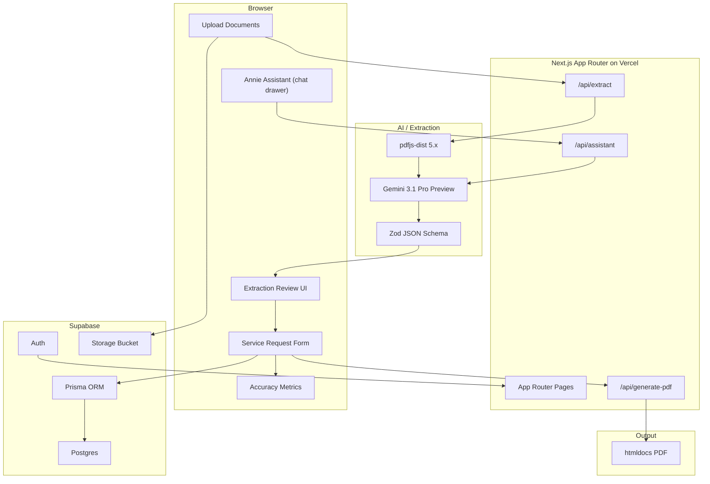
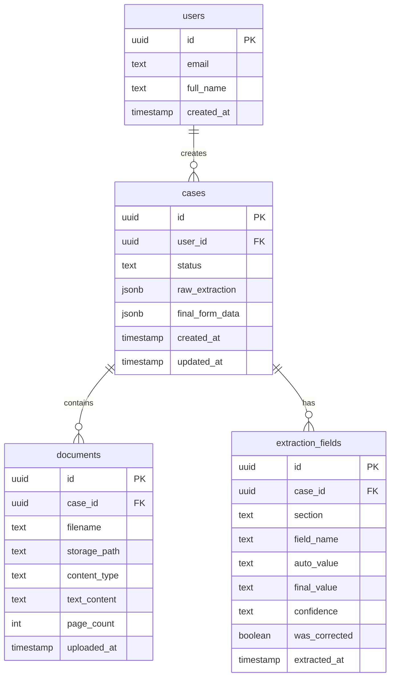

# Implementation Plan

## Overview

A Next.js web application that extracts structured data from healthcare documents using Gemini multimodal AI, auto-fills a service request form with per-field confidence scoring, and tracks correction accuracy over time. Deployed on Vercel with Supabase + Prisma backend.

## Design Principles

- **Employer-aligned stack.** Next.js (App Router), Supabase (Auth + Postgres + Storage), Prisma ORM, Vercel deployment.
- **shadcn/ui for UI primitives.** Radix + CVA pattern, standard and well-documented.
- **Supabase for all persistence.** Auth, Postgres via Prisma, file storage. Single source of truth.
- **Bespoke Annie assistant.** Thin `useAnnie` hook + chat drawer, context-aware, powered by Gemini Flash.
- **Gemini as primary AI provider.** Single provider for extraction and assistant. Clean, focused integration via `@google/genai`.
- **Extraction quality and form UX are the priority.** These are what the employer evaluates most heavily.

## Architecture



## ERD (Supabase Postgres via Prisma)



Correction tracking is derived from `extraction_fields` where `was_corrected = true` — no separate metrics table needed.

## Dependencies (verified April 10, 2026)

| Dependency | Version | Notes |
|---|---|---|
| **Next.js** | 16.2.x | Latest stable App Router |
| **Tailwind CSS** | 4.2.x | CSS-first config |
| **shadcn/ui** | latest | `npx shadcn@latest init` + add components as needed |
| **@google/genai** | latest | Unified Gemini SDK |
| **Zustand** | 5.0.x | UI state + `persist` to localStorage |
| **pdfjs-dist** | 5.6.x | PDF text layer extraction |
| **@supabase/supabase-js** | 2.103.x | Auth + Storage client |
| **Prisma** | 7.7.x | Type-safe ORM for Supabase Postgres |
| **htmldocs** | latest (canary) | React + Tailwind PDF templates |
| **Biome** | 2.4.x | Lint + format |
| **Husky** | latest | Git hooks |
| **Zod** | latest | Schema validation + Gemini structured output |

## Wireframes

Pre-implementation wireframes live in `docs/wireframes/`. Each phase below references the corresponding wireframe. The agent must follow these layouts when building UI.

| # | Wireframe | Route | Phase |
|---|-----------|-------|-------|
| 00 | Navigation Flow | — | All |
| 01 | App Shell / Layout | `layout.tsx` | Phase 1 |
| 02 | Dashboard / Case List | `/` | Phase 2a |
| 03 | Upload Documents | `/case/[id]` (source docs panel) | Phase 2a |
| 04 | Case Review & Form | `/case/[id]` | Phase 2b–2d |
| 05 | Annie Drawer | Sheet on `/case/[id]` | Phase 4 |
| 06 | PDF Preview | `/case/[id]/pdf` | Phase 2e |
| 07 | Metrics Dashboard | `/metrics` | Phase 2f |
| 08 | Sign In | `/sign-in` | Phase 3 |

## Phase Breakdown

### Phase 0 — Planning & Documentation

Initial commit with planning artifacts before any code. Demonstrates a plan-first approach.

- `.gitignore` (Node, Next.js, env files, `.cursor/`, IDE files)
- `docs/technical-challenge-master-prompt.md` — challenge brief and approach
- `docs/implementation-plan.md` — this file (architecture, phases, ERD, risks)
- `docs/wireframes/` — pre-implementation wireframes for all pages and flows (00–08)
- `sample-documents/` — eight challenge PDFs for extraction testing
- `annie-avatar.webp` — Annie assistant photo asset (repo root, copied to `public/` in Phase 1)
- **Commit** directly on `main`: *"Phase 0: planning docs, wireframes, challenge assets"*
- Create `develop` branch from `main`

### Phase 1 — Scaffold and Infra (~1.5 hours)

- `npx create-next-app@latest` (App Router, TypeScript strict, Tailwind v4)
- `npx shadcn@latest init` + core components: button, dialog, input, label, select, tooltip, badge, card, tabs, separator, scroll-area, dropdown-menu, sheet, accordion, table, progress
- Biome + `.editorconfig` + Husky + lint-staged
- `.github/workflows/ci.yml` — Biome lint + type-check on push/PR
- Supabase project: Auth (email + Google OAuth), Postgres, Storage bucket
- Prisma init: `prisma/schema.prisma` matching the ERD, `npx prisma db push`
- Copy `annie-avatar.webp` to `public/`
- Zustand store skeleton (UI state, `persist` to localStorage)
- Brand: CSS variables in `globals.css` matched to Solum palette. `next/font` for typography.
- **App shell layout** per wireframe 01: top nav bar (logo, Dashboard/Metrics/Docs links, user avatar, sign-out)
- Deploy skeleton to Vercel
- **Branch**: `phase/1-scaffold`

### Phase 2 — Extraction MVP (P0) (~5 hours)

The core deliverable. Most time goes here.

**2a. Document Upload + Dashboard**
> Wireframes: 02 (Dashboard), 03 (Upload), 00 (Navigation Flow)

- **Dashboard** (`/`): Case list table with columns per wireframe 02 — Case ID, Patient Name, Status badge, Documents count, Created date, View action. "+ New Case" button creates a draft case (status: `Draft`) and navigates to `/case/[id]`.
- **Status badges**: Draft → Extracting → In Review → Completed
- **Document upload** (wireframe 03, on Case Review): Source Documents panel on `/case/[id]` provides drag-and-drop + file picker per wireframe 03. Accept PDF, PNG, JPG, TIFF. Upload queue shows per-file progress bars with filename and size.
- Upload files to Supabase Storage, save document records to Postgres via Prisma (linked to case).
- **"Extract All"** (from case review): disabled until uploads complete as required. Triggers `/api/extract` for each document. Status indicators change to "Extracting..." with a loading state. On completion, user remains on `/case/[id]` (Case Review).

**2b. Extraction Pipeline** (`/api/extract`)
- Extract text layer via `pdfjs-dist`
- If text is thin/empty, render pages to images via canvas
- Send text + page images to Gemini 3.1 Pro Preview via `@google/genai`
- Structured output: `responseMimeType: "application/json"` + Zod-derived JSON schema
- Per-field confidence scoring (`high` / `medium` / `low`)
- System prompt defines all 7 sections (A–G), instructs confidence logic, handles missing fields
- Save raw extraction JSON to `cases.raw_extraction`, compute aggregate confidence, and save per-field records to `extraction_fields` via Prisma
- Update case status to `In Review`

**2c. Extraction JSON Schema** (`lib/types/service-request.ts`)
- Sections A–G from `07-service-request-form.pdf`:
  - **Header**: payer, dateOfRequest, payerFax, payerPhone
  - **A** (Member Information): name, dob, gender, memberId, groupNumber, phone, address
  - **B** (Requesting Provider): name, npi, facility, taxId, phone, fax, address
  - **C** (Referring Provider): name, npi, phone
  - **D** (Service Information): serviceType, serviceSetting, cptCodes[], icd10Codes[], diagnosisDescriptions[], startDate, endDate, sessions, frequency
  - **E** (Clinical Information): symptoms, clinicalHistory, medications[], assessmentScores[], treatmentGoals
  - **F** (Justification): medicalNecessity, riskIfDenied
  - **G** (Attestation): providerSignature, printedName, date, licenseNumber
- Each field: `{ value: string; confidence: "high" | "medium" | "low"; source?: string }`

**2d. Service Request Form UI** (Case Review page)
> Wireframe: 04 (Case Review & Service Request Form)

Two-column layout per wireframe 04:

- **Left column — Source Documents panel**:
  - Tabbed interface showing embedded preview of each uploaded document (one tab per doc)
  - Metadata line below preview: extraction date, document count, aggregate confidence percentage
  - **"Re-extract" button**: re-runs `/api/extract` on the case's documents (useful if user uploads additional docs or wants a fresh extraction)
- **Right column — Service Request Form (Sections A–G)**:
  - Accordion/collapsible sections. Section A expanded by default, others collapsed.
  - Each field shows AI-extracted value with confidence indicator: green dot (high, ≥90%), yellow dot (medium, 70–89%), red dot (low, <70%)
  - Empty/missing fields flagged with a prominent "Missing" indicator
  - Clicking a field makes it editable inline. Edits are tracked as corrections (`auto_value` vs `final_value`, `was_corrected = true`).
- **Action buttons** at bottom right:
  - **"Save Draft"**: persists current form state via Prisma, keeps status `In Review`
  - **"Approve & Generate PDF →"**: marks all corrections as final, sets case status to `Completed`, triggers PDF generation, navigates to `/case/[id]/pdf`

**2e. PDF Generation & Preview**
> Wireframe: 06 (PDF Preview)

- React template matching `07-service-request-form.pdf` layout, generated by htmldocs via `/api/generate-pdf`
- **PDF Preview page** (`/case/[id]/pdf`) per wireframe 06: inline PDF viewer with toolbar — "← Back to Case", "Download PDF", "Print", "Regenerate"
- Page pagination for multi-page documents
- Fallback: `@react-pdf/renderer` if htmldocs blocks

**2f. Correction Metrics View**
> Wireframe: 07 (Extraction Metrics Dashboard)

Per wireframe 07:
- **4 stats cards** at top: Total Cases, Average Confidence, Fields Corrected (count / total + percentage), Documents Processed
- **Bar chart**: "Corrections by Form Section" — correction rate per section (A–G), identifying which sections need the most human review
- **Recent Corrections table**: Case, Field, Original Value, Corrected Value, Section, Date
- Data sourced from `extraction_fields` where `was_corrected = true`, grouped by field_name, section, and confidence

- **Branch**: `phase/2-extraction-mvp`
- Merge into `develop` then `main` with tag `v0.2-phase2`

### Extraction Quality Gate (during Phase 2b)

- Run extraction on **all 8 sample PDFs** as soon as the pipeline works
- Evaluate results, especially `06-handwritten-clinical-note.pdf`
- If Gemini handles all docs acceptably: no Phase B needed, document results in README
- If handwriting fails: decide on GCP Document AI or document as known limitation
- This is a **decision point**, not a pre-planned phase

### Phase 3 — Auth and Polish (P1) (~1.5 hours)
> Wireframe: 08 (Sign In)

- Supabase Auth middleware: protect all routes except `/sign-in`
- **Sign-in page** per wireframe 08: centered card with email/password form, "Forgot password?" link, "Sign in with Google" button, sign-up link at bottom
- RLS policies on all tables (user sees own cases only)
- Polish: loading states, error boundaries, responsive layout
- **Branch**: `phase/3-auth-polish`

### Phase 4 — Annie Assistant (P2) (~2 hours)
> Wireframes: 05 (Annie Drawer), 01 (App Shell — FAB placement)

Bespoke, thin implementation:

- **Annie FAB**: floating button in the bottom-right corner, visible only on case review pages (`/case/[id]`). Shows Annie's avatar or a chat icon.
- **Annie drawer** per wireframe 05: shadcn Sheet sliding from right side, with Annie's avatar photo and "AI Case Assistant · Powered by Gemini Flash" subtitle
- **`/api/assistant` route handler**: Gemini Flash Preview, streaming response via `ReadableStream`
- **Context injection**: Current case extraction JSON + form state injected into system prompt
- Annie can: explain confidence scores, suggest corrections, answer questions about extracted data, summarize the case
- **`useAnnie` hook**: manages message history (Zustand persist per case), sends messages, handles streaming, abort
- **UI**: message bubbles — Annie's avatar on assistant messages, user messages right-aligned. Text input at bottom with send button. Typing indicator during streaming.
- **Branch**: `phase/4-annie-assistant`

### Phase 5 — Stretch (only if time allows)

- Phase B OCR hardening (if quality gate triggers it)
- Unit tests (Vitest) and E2E tests (Playwright) — deferred to preserve AI coding tokens for core features within the challenge timeframe
- Polish pass on responsive layout and edge cases

## Key File Structure

```
solum-health-TC/
  .github/
    workflows/
      ci.yml
  docs/
    wireframes/                   # Pre-implementation wireframes (00–08)
    implementation-plan.md        # This file
    DEVLOG.md                     # Daily development journal
    technical-challenge-master-prompt.md
  public/
    annie-avatar.webp
  src/
    app/
      layout.tsx                  # App shell: top nav, Annie FAB — wireframe 01
      page.tsx                    # Dashboard / case list — wireframe 02
      sign-in/page.tsx            # Auth page — wireframe 08
      case/[id]/page.tsx          # Case review + form + upload (wireframes 03–04)
      case/[id]/pdf/page.tsx      # PDF preview — wireframe 06
      metrics/page.tsx            # Accuracy metrics — wireframe 07
      api/
        extract/route.ts          # Extraction pipeline
        generate-pdf/route.ts     # PDF generation
        assistant/route.ts        # Annie streaming
    components/
      ui/                         # shadcn components (auto-generated)
      app-nav.tsx                 # Top navigation bar
      case-list-table.tsx         # Dashboard table with status badges
      source-documents-panel.tsx  # Left column: upload, doc tabs + preview + re-extract
      service-request-form.tsx    # Right column: sections A–G accordion
      form-field.tsx              # Confidence-aware field wrapper (green/yellow/red)
      form-section.tsx            # Collapsible accordion section
      annie-fab.tsx               # Floating action button (case pages only)
      annie-drawer.tsx            # Chat drawer with avatar + streaming
      pdf-viewer.tsx              # Inline PDF preview with pagination
      metrics-dashboard.tsx       # Stats cards + chart + corrections table
    lib/
      supabase/
        client.ts
        server.ts
        middleware.ts
      prisma.ts
      ai/
        gemini.ts
        extraction-prompt.ts
        extraction-schema.ts
      types/
        service-request.ts
    stores/
      ui-store.ts                 # Zustand: annie drawer, sidebar state
    hooks/
      use-annie.ts               # Chat state + streaming per case
      use-extraction.ts          # Upload + extract flow
      use-form-corrections.ts    # Track field edits as corrections
  prisma/
    schema.prisma
  biome.json
  .editorconfig
  next.config.ts
  tsconfig.json
  package.json
  README.md
```

## Model Recommendation

| Task | Model ID | Rationale |
|---|---|---|
| **Document extraction** | `gemini-3.1-pro-preview` | Flagship; best multimodal accuracy, native structured output |
| **Annie assistant** | `gemini-3-flash-preview` | Fast streaming, low latency for chat UX |

Historical note: env vars evolved to OpenAI-default extraction + `EXTRACTION_GEMINI_MODEL_ID` when using Gemini extraction (`EXTRACTION_PROVIDER=gemini`).

## Risk Register

| Risk | Impact | Mitigation |
|---|---|---|
| **Handwritten doc extraction quality** (doc 06) | Medium | Test all 8 PDFs early; Gemini multimodal with page images; GCP Document AI as fallback |
| **htmldocs integration issues** | Medium | Fallback to `@react-pdf/renderer` |
| **Gemini model deprecation** | Low | Env-driven model IDs; verify via `models.list` before shipping |
| **Time overrun on form UI** | Medium | Ship functional first, polish second |
| **Supabase cold start in demo** | Low | Pre-warm before Loom recording |

## Git Strategy

1. `git init` with `.gitignore`
2. Phase 0 commit on `main`: planning docs, wireframes, challenge assets
3. Remote: `https://github.com/arizakevin/solum-health-TC.git`
4. Push `main`, create `develop`, branch per phase (`phase/1-scaffold`, `phase/2-extraction-mvp`, etc.)
5. Merge phases into `develop` then `main` at stable checkpoints
6. Tag milestones: `v0.1-phase1`, `v0.2-phase2`, etc.

## Branding

- Inspect [getsolum.com](https://getsolum.com) computed styles for fonts, weights, palette
- Dark surfaces, white headings, cool blue-green accent
- CSS variables in `globals.css` + `next/font` + Tailwind theme extension
- Single cohesive brand — no theme switching UI
- Annie avatar: `public/annie-avatar.webp`

## Trello Board

**Lists:** ToDo | Doing | Done | Backlog

**Done:**
- [Phase 0] Planning docs, wireframes, challenge assets

**ToDo:**
- [P0] Scaffold: Next.js + shadcn + Prisma + Biome + Supabase
- [P0] Document upload + Supabase Storage
- [P0] Extraction API: pdfjs + Gemini structured output
- [P0] Service request form UI with confidence flags
- [P0] PDF generation (htmldocs)
- [P0] Correction metrics view
- [P1] Supabase Auth + protected routes + RLS
- [P2] Annie assistant (chat drawer)
- [Deliverable] README + architecture
- [Deliverable] Loom recording
- [Deliverable] Vercel live link

**Backlog** (attempt if time allows, otherwise documented as "more time" improvements):
- Unit tests (Vitest) + E2E tests (Playwright) — deferred to preserve AI coding tokens for features
- Realtime voice chat with Annie (OpenAI Realtime API, WebRTC)
- Phase B OCR hardening (GCP Document AI via FastAPI on Railway)
- Batch document processing
- HIPAA-hardened storage

## Scope Boundaries

- **Persistence:** Supabase Postgres (via Prisma) + Storage. No local-first / offline architecture.
- **AI provider:** Gemini only. Bespoke integration, not a multi-provider framework.
- **UI:** shadcn/ui components. Single Solum-branded theme.
- **Testing:** Deferred to backlog. AI coding token budget prioritized for core features within the challenge timeframe.
- **Voice:** On the backlog. Built if time allows, otherwise documented as future improvement.
- **i18n:** Out of scope.
