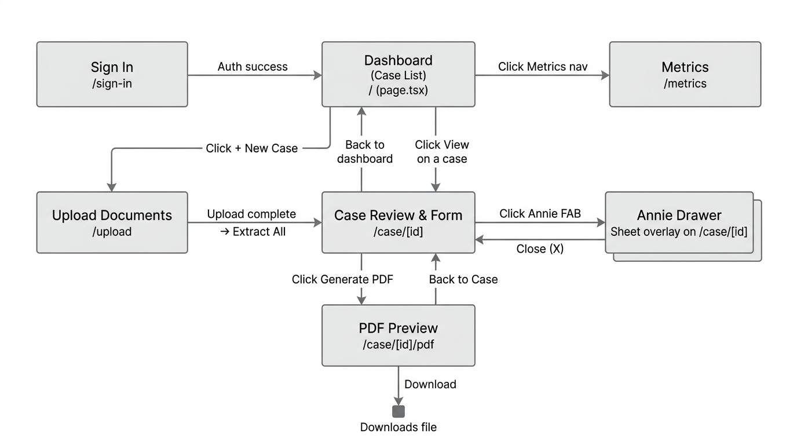
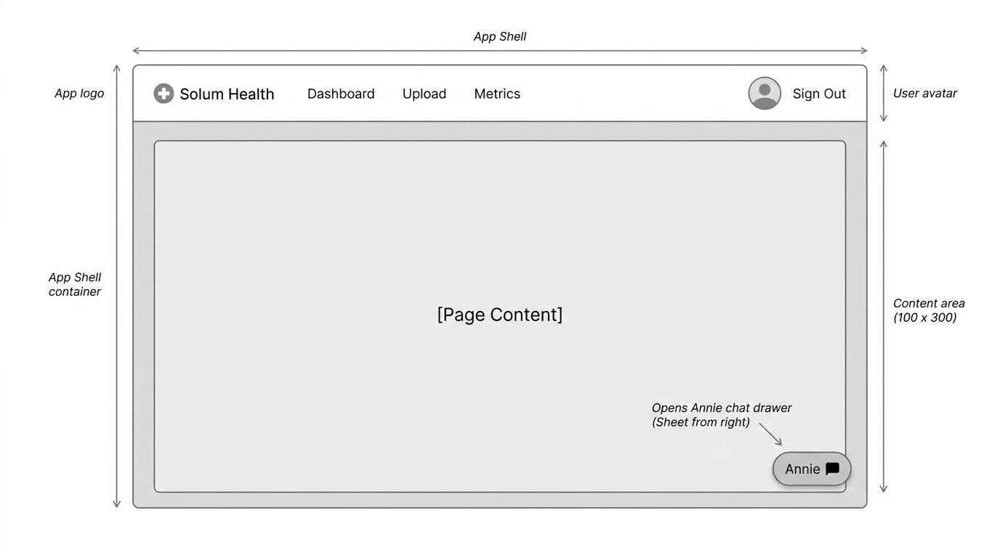
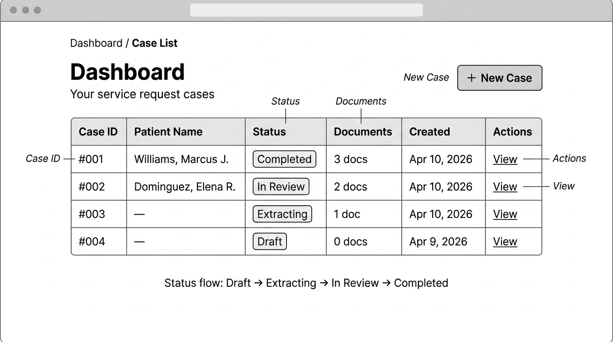
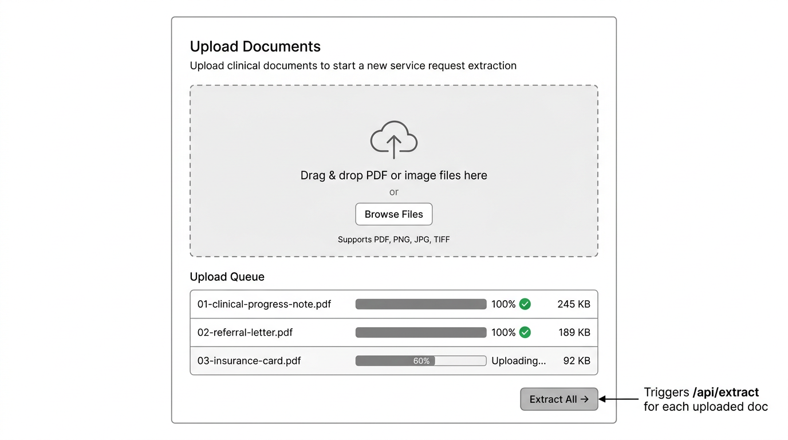
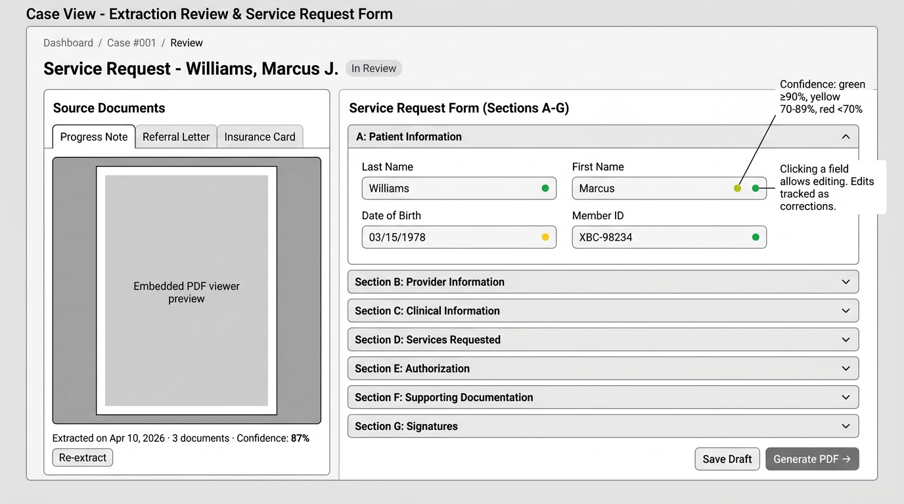
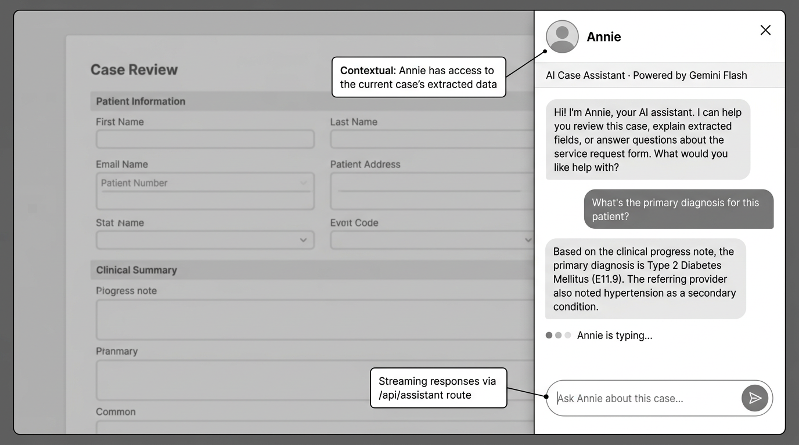
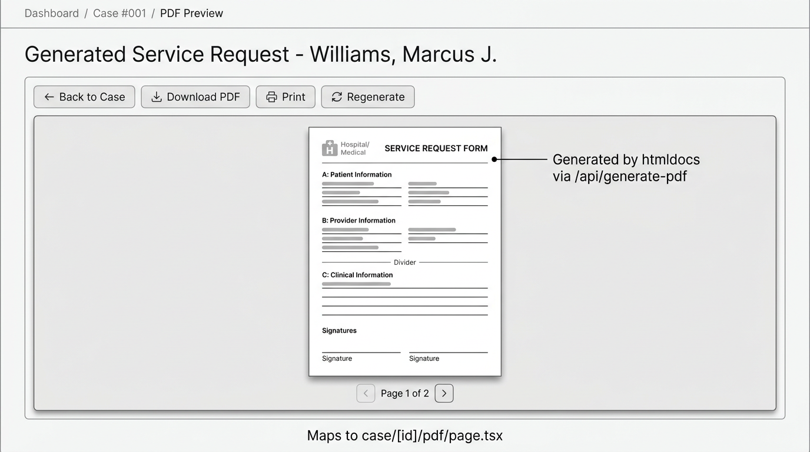
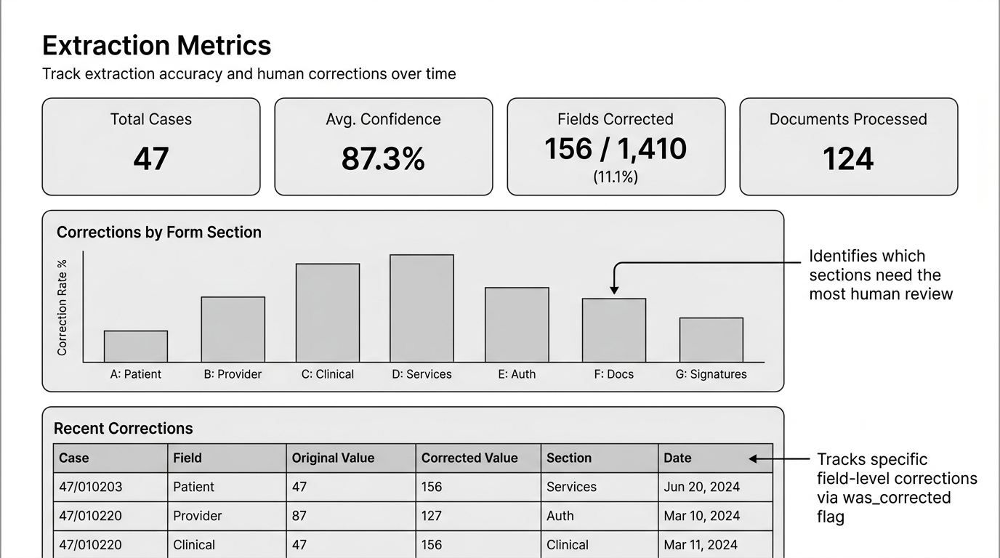
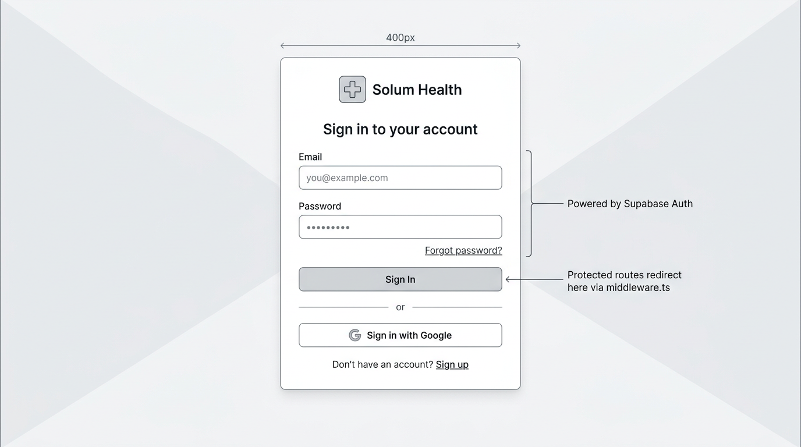

# Wireframes — Solum Health Service Request App

Pre-implementation wireframes covering every page, overlay, and the overall navigation flow.

---

## 00 — Navigation Flow

**Routes and transitions between all pages.** Entry via `/sign-in`, hub at the Dashboard (`/`), branching to Upload, Case Review, Metrics, and PDF Preview. The Annie drawer is a sheet overlay on the Case Review page.

---

## 01 — App Shell / Layout

**Shared layout wrapping all authenticated pages.** Top navigation bar with logo, nav links (Dashboard, Upload, Metrics), user avatar, and sign-out. The Annie floating action button lives in the bottom-right corner of the content area and opens the chat drawer.

---

## 02 — Dashboard / Case List

**Landing page after sign-in (`/`).** Shows all service request cases in a table with Case ID, Patient Name, Status badge, document count, creation date, and a View action. The "+ New Case" button navigates to the Upload page. Status flow: Draft → Extracting → In Review → Completed.

---

## 03 — Upload Documents

**Document upload page (`/upload`).** Drag-and-drop zone accepting PDF, PNG, JPG, and TIFF files. An upload queue below shows progress per file. Once all uploads complete, the "Extract All" button triggers the `/api/extract` pipeline for each document, then redirects to the Case Review page.

---

## 04 — Case Review & Service Request Form

**Core page of the app (`/case/[id]`).** Two-column layout:

- **Left — Source Documents**: Tabbed panel showing embedded previews of each uploaded document. Metadata line with extraction date, document count, and aggregate confidence score. "Re-extract" button available.
- **Right — Service Request Form (Sections A–G)**: Accordion sections matching the official form. Each field shows the AI-extracted value with a confidence indicator (green ≥ 90%, yellow 70–89%, red < 70%). Clicking a field opens it for editing; edits are tracked as corrections for the metrics page. "Save Draft" persists to Supabase; "Generate PDF" triggers the htmldocs pipeline and navigates to the PDF Preview.

---

## 05 — Annie AI Assistant Drawer

**Sheet overlay on the Case Review page.** Opens from the right via the floating Annie button. Annie is a context-aware assistant powered by Gemini Flash that has access to the current case's extracted data. Supports streaming responses via `/api/assistant`. Users can ask Annie to explain extracted fields, summarize clinical notes, or answer questions about the service request form.

---

## 06 — PDF Preview

**Preview page (`/case/[id]/pdf`).** Shows the generated Service Request Form PDF inline before download. Toolbar with Back to Case, Download PDF, Print, and Regenerate actions. PDF is generated server-side by htmldocs via `/api/generate-pdf`. Pagination for multi-page documents.

---

## 07 — Extraction Metrics Dashboard

**Metrics page (`/metrics`).** Four summary cards at the top: Total Cases, Average Confidence, Fields Corrected (count and percentage), Documents Processed. A bar chart breaks down correction rates by form section (A–G), identifying which sections need the most human review. Below, a Recent Corrections table tracks individual field-level edits with original vs. corrected values.

---

## 08 — Sign In

**Authentication page (`/sign-in`).** Centered card with email/password form and Google OAuth option. Powered by Supabase Auth. Protected routes redirect here via `middleware.ts`. Includes sign-up link for new users.
